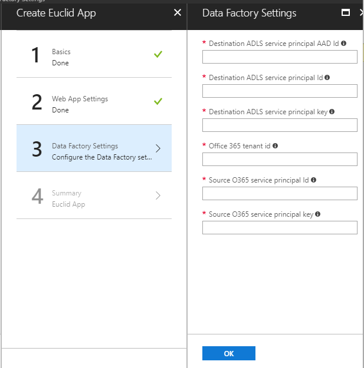
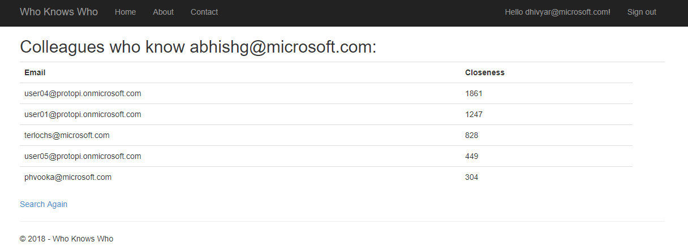

# Project Euclid Dev Doc

Before we begin exploring the sample application, here are a few
resources to get you started with the involved technologies:

- [Azure Data Factory](https://docs.microsoft.com/en-us/azure/data-factory/)
- [Azure Data Lake Analytics](https://docs.microsoft.com/en-us/azure/data-lake-analytics/)
- [Azure ARM Templates](https://azure.microsoft.com/en-us/resources/templates/)
- [Azure ARM Template Samples](https://github.com/Azure/azure-quickstart-templates)
- [Azure Managed App](https://docs.microsoft.com/en-us/azure/managed-applications/)
- [Azure Managed App Samples](https://github.com/Azure/azure-managedapp-samples/tree/master/samples)

## Overview

Azure Managed Applications
====================================================
The Azure Managed App on Office 365 can be broken down into 3
components:

- Data Ingestion from Euclid/Office365
- Data processing/analytics to produce intelligent data
- UX to surface the intelligent data

We will work through a sample that covers all three components:

1. We use Azure Data Factory (ADF) with copy activity to move data from O365 to your target adls.
2. We then have an azure web app that reads the data at target adls and outputs intelligent data.

## Create and publish an O365-powered Azure managed application:

The instructions below will help you create and publish an Azure managed
application internally.

You can take a look at this doc for reference:
[Publish a managed application for internal consumption](https://docs.microsoft.com/en-us/azure/managed-applications/publish-service-catalog-app).

### Prerequisites

Before you begin, you need to install some prerequisites, depending on which shell you prefer to use: Bash or Powershell.

#### Bash

In order to use Bash, install the following:

- [Node.js and npm](https://docs.npmjs.com/getting-started/installing-node)
- [jq](https://stedolan.github.io/jq/download/)
- [azure-cli](https://docs.microsoft.com/en-us/azure/cli-install-nodejs)

After installing the above pre-requisites, open Bash and use the following command to login to your Azure subscription.

```bash
azure login
```

#### Powershell

In order to use Powershell, install the following:

- [Azure Powershell](https://docs.microsoft.com/en-us/powershell/azure/install-azurerm-ps?view=azurermps-4.4.0)

After installing the above pre-requisites, open Powerhsell and use the following command to login to your Azure subscription.

```PowerShell
Login-AzureRmAccount
```

### Step 1: Create the app template

Create a template that defines the resources to deploy with the managed application (refer to [mainTemplate.json](ManagedApp\mainTemplate.json)).

If you look at the **mainTemplate.json**, it consists of three main sections

#### Parameters

Contains the list of parameters whose values will be provided by the
user.

| Parameter name | Description |
|----------------|-------------|
| `WebSiteName` | The website name, used as the prefix in the url of the published web app. For example: `<websitename>.azurewebsites.net` |
| `DestinationServicePrincipalAadId` | The Azure Active Directory ID of the service principal to be granted access to the destination Data Lake store |
| `DestinationServicePrincipalId` | The app ID of the service principal that has access to the destination Data Lake store |
| `DestinationServicePrincipalKey` | The app secret of the service principal that has access to the destination Data Lake store |
| `Office365TenantId` | The Office 365 tenant for which data needs to be extracted |
| `ServicePrincipalId` | The app ID of the service principal that has access to the source Office 365 data |
| `ServicePrincipalKey` | The app secret of the service principal that has access to the source Office 365 data |

Before we fill in this section, you need to create an Azure AD service principal to grant access to the Destination
ADLS following these [instructions](https://docs.microsoft.com/en-us/azure/azure-resource-manager/resource-group-create-service-principal-portal). You need to follow the sections titled [Create an Azure Active Directory application](https://docs.microsoft.com/en-us/azure/azure-resource-manager/resource-group-create-service-principal-portal#create-an-azure-active-directory-application) and [Get application ID and authentication key](https://docs.microsoft.com/en-us/azure/azure-resource-manager/resource-group-create-service-principal-portal#get-application-id-and-authentication-key).

> **Note:** the sign-on url should be `https://webSiteName.azurewebsites.net`.
>
> `webSiteName` can be anything you want, just ensure that you
think of something that will be unique around the globe and it will be
the same value that will be specified to the `WebSiteName` parameter.

##### Filling in the parameters:

- `WebSiteName` is the same value you set for the sign-on url.
- `DestinationServicePrincipalId` is the Application ID of your service principal.
- `DestinationServicePrincipalKey` is the Authentication Key you generated for your service principal.
- `DestinationServicePrincipalAadId` can be found by running the following command in your shell.

> **Note:** Do not use the object id that you see on Azure portal.

###### Bash

```bash
azure ad sp show -c <service principal friendly name>
```

Use the value shown for `Object Id`.

###### Powershell

```Powershell
Get-AzureRmADServicePrincipal -SearchString <service principal friendly name>
```

Use the value shown for `Id`.

#### Variables 

Contains the list of variables. You can update the variable values if
needed.

#### Resources

Contains the list of resources that will be deployed as a part of the
managed app creation.

Below are few of the resources that will be deployed as a part of the
**mainTemplate.json** explained briefly.

| Resource name | Description |
|---------------|-------------|
| `DestinationAdlsAccount` | Creates the destination Data Lake store in the customer's subscription used in the ADF pipeline for the data output. |
| `DataFactory` | Creates the ADF pipeline that copies data from O365 to the newly created destination ADLS (`DestinationAdlsAccount` that was created above) |
| `SourceLinkedService` | Creates the link to O365 which is used as the source of the data extraction. Using service principal supplied by the source ADLS owner. |
| `DestinationLinkedService` | Creates the link to the newly created destination ADLS, using service principal supplied by the customer deploying this template. |
| `InputDataset` | You should change the structure in this resource to match the table and columns that you would like to extract. In this template we are trying to extract messages and the structure corresponds to that Office365 table. |
| `OutputDataset` | Corresponds to the `DestinationAdlsAccount` where we wanted the data to be copied to. |
| `Pipeline` | The Copy activity pipeline that copies the data from source O365 to the destination ADLS |
| `PipelineTriggers` | Contains settings to ensure the copy pipeline can be scheduled to run periodically. |
| `WebApp` | Creates the web app that uses data stored in the newly created destination ADLS. |

### Step 2: Create the UI definition

Define the user interface elements for the portal when deploying the
managed application (refer to [createUiDefinition.json](ManagedApp/createUiDefinition.json)). The Azure portal
uses the **createUiDefinition.json** file to generate the user interface for
users who create the managed application. You define how users provide
input for each parameter. You can use options like a drop-down list,
text box, password box, and other input tools. To learn how to create a
UI definition file for a managed application, see [Get started with
CreateUiDefinition](https://docs.microsoft.com/en-us/azure/managed-applications/create-uidefinition-overview).

The values of the parameters defined in **mainTemplate.json** are supplied
through the UI generated by **createUiDefinition.json** when the managed
application is being created.

### Step 3: Package the files

Follow the steps under the section [Packages the Files](https://docs.microsoft.com/en-us/azure/managed-applications/publish-service-catalog-app#package-the-files) in [Publish a managed application for internal consumption](https://docs.microsoft.com/en-us/azure/managed-applications/publish-service-catalog-app) for packaging the template files and uploading them to a blob storage.

### Step 4: Assign a user group or application

Create a user group or application for managing the resources on behalf
of a customer by following the steps under the section [Create the managed application definition](https://docs.microsoft.com/en-us/azure/managed-applications/publish-service-catalog-app#create-the-managed-application-definition) in [Publish a managed application for internal consumption](https://docs.microsoft.com/en-us/azure/managed-applications/publish-service-catalog-app)

Get the role definition ID by following the steps in[Get the role definition ID](https://docs.microsoft.com/en-us/azure/managed-applications/publish-service-catalog-app#get-the-role-definition-id).

### Step 5: Create the managed application definition

Create the managed application definition using the following command

```Powershell
New-AzureRmManagedApplicationDefinition -Name "EuclidManagedApp" -Location "westcentralus" -ResourceGroupName appDefinitionGroup -LockLevel ReadOnly -DisplayName "O365 powered Managed Application" -Description "O365 powered Managed Application" -Authorization <role definition ID that was obtained in Step 4> -PackageFileUri <Path to the blob storage where the zip file wasuploaded in Step 3>
```

### Step 6: Create the managed application

You can create the managed application by following the steps listed
below.

1. Go to Azure Portal and choose **Managed Applications** from **All Services**.
1. Click on **Add** and you will see the Managed Application definition that we created above.
1. Select the Managed App definition that you want to create and click on create.
1. The Create app window appears as below where you can specify the values for the parameters (discussed in Step 1)
    

The deployment of the app starts and once it completes you will be able to see it in the dashboard.

### Step 7: Try it out

Click on the app and in the overview section you will see two resource
groups. Click on the managed resource group.

You will notice that all the resources mentioned in the ARM template
have been created successfully.

#### Running the ADF Pipeline

Execute the following commands in your shell to kick off the ADF pipeline.

##### Powershell

1. Create variable for resource group name, data factory name, and pipeline name

    ```Powershell
    $resourceGroupName = <name of the managed resource group which contains the data factory>
    $dataFactoryName = <data factory name>
    $pipelineName = <pipeline name that was specified in the ARM template under variables section>
    ```
1. Start the pipeline:

    ```Powershell
    Invoke-AzureRmDataFactoryV2Pipeline -ResourceGroupName $resourceGroupName -DataFactory $dataFactoryName -PipelineName $pipelineName
    ```


#### Schedule the pipeline

Execute the following commands in your shell to run the pipeline on a scheduled basis.

##### Powershell

1. Create variable for resource group name, data factory name, and trigger name

    ```Powershell
    $resourceGroupName = <managed resource group name>
    $dataFactoryName = <data factory name>
    $triggerName = <trigger name>
    ```
1. Start trigger:

    ```Powershell
    Start-AzureRmDataFactoryV2Trigger -ResourceGroupName $resourceGroupName -DataFactoryName $dataFactoryName -TriggerName $triggerName
    ```
1. Get status of the trigger:

    ```Powershell
    Get-AzureRmDataFactoryV2Trigger -ResourceGroupName $resourceGroupName -DataFactoryName $dataFactoryName -Name $triggerName
    ```

You should see a response similar to the following.

```Powershell

TriggerName : MarsEuclidTestTrigger
ResourceGroupName : MarsEuclid1\_ResourceGroup
DataFactoryName : MarsEuclid2DataFactory
Properties :
    Microsoft.Azure.Management.DataFactory.Models.ScheduleTrigger
RuntimeState : Started
```

If you need to stop the trigger, use the following command.

```Powershell
Stop-AzureRmDataFactoryV2Trigger -ResourceGroupName $resourceGroupName -DataFactoryName $dataFactoryName -TriggerName $triggerName
```

#### Monitor the Pipeline

1. In the Azure Portal, go to your data factory.
1. Click on the Author & Monitor quick link tile.
1. In the Azure Data Factory page that opens, click on the monitor icon. You will be able to see the ADF pipelines and their status.

## Web App Sample UX


