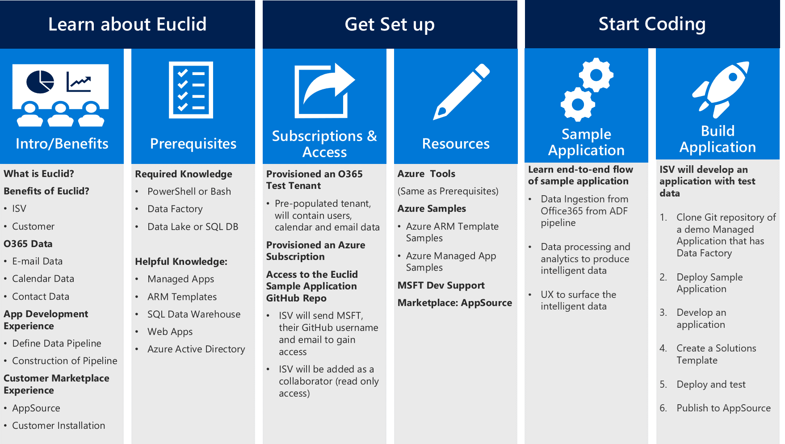

# Project Euclid: Private Preview On-boarding Overview

This document provides an overview of the Project Euclid on-boarding process.

Quick Overview of Euclid On-boarding Process

## Learn about Euclid

See the [Intro to Euclid](Intro-to-Euclid.md) document for a description of Euclid,
the benefits of Euclid, O365 data, app development experience and customer
marketplace experience.

### Prerequisites

The following tools and resources are required to develop your application:

- Azure Subscription & O365 Test Tenant: For private preview, Microsoft will provide an Azure Subscription and O365 Test Tenant.
- Bash **or** Azure PowerShell:
    - **Bash:** You should have installed: [Node.js and npm](https://docs.npmjs.com/getting-started/installing-node), [Jq](https://stedolan.github.io/jq/download/) and [azure-cli](https://docs.microsoft.com/en-us/azure/cli-install-nodejs)
    - **Azure PowerShell** You should have installed: [Azure PowerShell](https://docs.microsoft.com/en-us/powershell/azure/install-azurerm-ps?view=azurermps-4.4.0)
- Azure: You should have foundational knowledge around Azure Applications Development, including the following topics:
    - [Azure Data Factory](https://docs.microsoft.com/en-us/azure/data-factory/)
    - [Azure Data Lake Analytics](https://docs.microsoft.com/en-us/azure/data-lake-analytics/)
    - [Azure Data Lake Analytics](https://docs.microsoft.com/en-us/azure/data-lake-analytics/)
    - [Azure Data Lake Store](https://docs.microsoft.com/en-us/azure/data-lake-store/)
    - [Azure CLI 2.0](https://docs.microsoft.com/en-us/cli/azure/overview?view=azure-cli-latest)
    - [Azure Managed Applications](https://azure.microsoft.com/en-us/roadmap/azure-managed-applications/)
    - [Azure SQL Database](https://docs.microsoft.com/en-us/azure/sql-database/)
    - [ARM Templates](https://docs.microsoft.com/en-us/azure/azure-resource-manager/resource-group-authoring-templates)
    - [Azure SQL Data Warehouse](https://docs.microsoft.com/en-us/azure/sql-data-warehouse/)
    - [Azure Web Applications](https://docs.microsoft.com/en-us/azure/app-service/app-service-web-overview)

## Get set up

Microsoft will provide an Office 365 test tenant and an Azure subscription for private preview. You can request a test tenant and an Azure subscription from the Microsoft Project Euclid Team. Microsoft will send you admin login information for the test tenant and Azure subscription.

Next, you'll need access to the [Project Euclid GitHub repository](https://github.com/OfficeDev/EuclidSampleAppExternal). If you don't have a GitHub account, you can sign-up for one at [GitHub](https://github.com). We'll need your GitHub account username and email to add you as a collaborator to the repository. The repository contains resources such as Azure template samples and the Azure sample managed app.

> **Note:** Microsoft will grant read-only access to the GitHub repository. 

## Start coding

### Sample managed application

Once you're setup, you're ready to get started with our sample application. Start with the [ISV Dev Doc](ISV-Dev-Dov.md), then move on to the step-by-step instructions to run the sample managed application from end-to-end. The three primary steps of the managed application are:

- Data Ingestion from Euclid/Office365
- Data processing
- Analytics to produce intelligent data and UX to surface the intelligent data.

### Build your own application

Once you're comfortable with the sample managed application flow, you're ready to start building your own application. You can develop an application with test data using these basic high-level steps:

1. Clone the sample GitHub repository
1. Replace Application VM with your business logic
1. Create a Solutions Template 
1. Deploy and test
1. Publish to AppSource

## Publishing your application

Once application development is complete, you can go to [AppSource](https://appsource.microsoft.com/en-us/partners/list-an-app) and begin the list on AppSource process. You'll need to validate that your application meets the [AppSource Guidelines](https://smp-cdn-prod.azureedge.net/documents/AppsourceGuidelines/Microsoft%20AppSource%20app%20review%20guidelines.pdf). 

> **Note:** If you are a partner, you must ensure that your app meets the [AppSource Partner Listing Guidelines](https://smp-cdn-prod.azureedge.net/documents/Microsoft%20AppSource%20Partner%20Listing%20Guidelines.pdf).

### Submit your app

Once you've ensured your app is ready to publish, you submit your app info to AppSource. Once the application has been reviewed the AppSource team will reach out to you for next steps.

### AppSource on-boarding

The Microsoft AppSource team will work with you during the on-boarding of the app, which includes staging, testing, and providing help to create a page to promote your app. They can also provide assistance with:

- Using the Managed Applications publishing interface
- Selecting the policies to be enforced 
- Creating SKU options and choosing the support price

Once AppSource onboarding is complete, your application will be published to AppSource.
